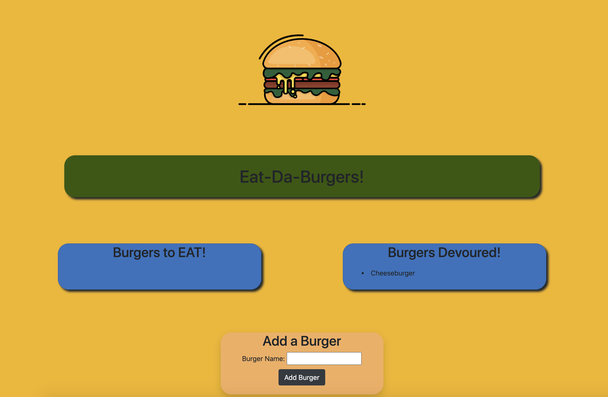

# EAT-DA-BURGER

  ## Description

  the Eat-Da-Burger application is an application that is meant to simulate deciding to DEVOUR a burger and enter new burgers into the mix. Realistically this application was developed to work with mysql, express, and express-handlebars. When you enter the data it is stored within a database that is referenced from mysql. This assignment was not super challenging but it will be important that I am able to use all of this again and include sequelize for project one
  

  ## Table of Contents

  *[installation](#installation)

  *[usage](#usage)

  *[contributing](#contributing)

  *[questions](#questions)

  *[license](#license)

  *[test](#test)

  ## Installation

  To install necessary dependencies, run the following command: npm install

  ## Usage

   eat burgers!!

  ## Contributing 
  Joseph Meus 

  ## License
    
      This Project is licensed under the MIT

  ## Tests 

  To run tests, run the following command:
  npm

  ## Questions 

  If you have any questions, feel free to contact me at meusjoseph21@gmail.com. 

  More of my work can be found at [meusjoseph21](https://github/com/meusjoseph21)

  githup repository: https://github.com/meusjoseph21/express-burgers-handlebars

  heroku link: https://polar-shore-82853.herokuapp.com/

  ## IMAGE REFERENCE

  

